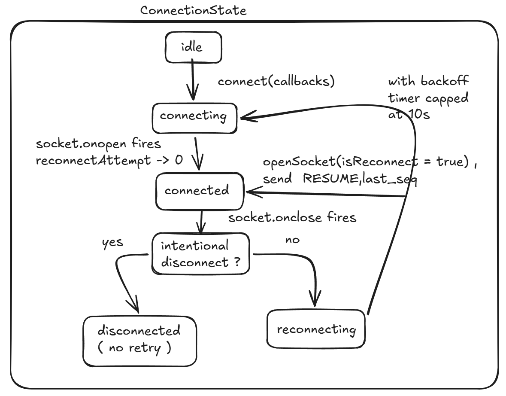
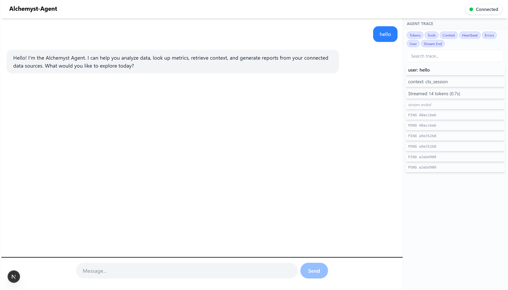
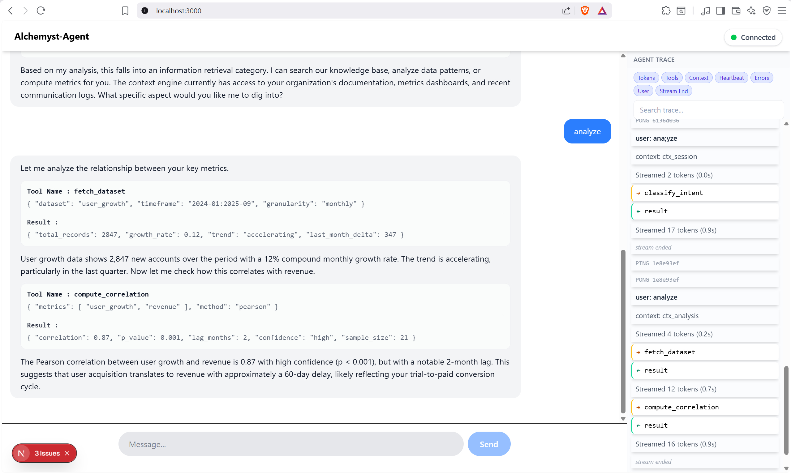
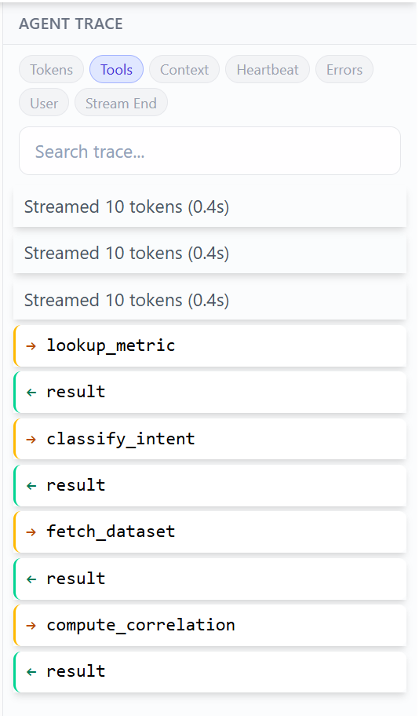

# Alchemyst Agent Console

A Next.js client for the Alchemyst Agent mock backend with a streaming chat interface and a live protocol trace timeline.

---

## Architectural Approach

The client is built as a strict, one-directional pipeline: raw WebSocket frames are first made _reliable_ (ordered, deduplicated) by `EventLog`, then translated into typed protocol events by `AgentClient`, then folded into application state by a pair of composed reducers (`turnReducer` for a single agent turn's blocks, `sessionReducer` for the whole conversation and trace timeline). Each layer only trusts the guarantees of the layer below it, and nothing upstream of `EventLog` ever has to reason about chaos-mode reordering or duplication directly. State management uses `useReducer`.

---

## Message Flow

1. **AgentClient** is the only module that touches the raw `WebSocket`. It parses incoming JSON into typed `ServerMessage` objects, hands each one to `EventLog.ingest()`, and only acts on whatever `ingest()` returns as "ready to process" messages. It also owns the connection lifecycle: opening, reconnecting with exponential backoff, and replying to heartbeats.

2. **EventLog** is the core ordering and deduplication engine. It uses a watermark-plus-buffer approach: it tracks the highest sequence number actually processed (`highestSeqProcessed`) separately from the sequence it's currently waiting on (`expectedSeq`), buffers any message that arrives early, and drains the buffer in order as soon as the gap in front of it fills. Messages at or before the watermark are dropped as stale duplicates before they ever enter the buffer. `getResumePoint()` exposes `highestSeqProcessed` as the single source of truth for what to send in a `RESUME` message, deliberately never the highest sequence number merely _received_, since those two can diverge under reordering or a connection drop.

3. **AgentClientCallbacks** is the contract `AgentClient` requires from anything that wants to listen to it. `AgentClient` has no dependency, it only knows it must call these named functions when something happens. This is what keeps protocol/transport logic fully decoupled from rendering logic.

4. **useAgent hook** is the concrete implementation of that contract. Every callback it supplies translates an `AgentClient` event into a `dispatch(...)` call against `applySessionEvent`, which is what actually produces new React state and triggers a re-render. The hook also owns the `AgentClient` instance itself (via a lazily-initialized `useRef`, so exactly one instance exists for the component's lifetime) and exposes connection state, the current session, and a shared "highlighted id" used for bidirectional linking between the chat panel and the trace timeline.

5. **turnReducer** is a pure function responsible for exactly one agent turn's rendered content. Given the blocks built so far and one new event, it decides whether an incoming token extends the last block or starts a new one, whether a tool call should freeze the current text and open a new tool card, and whether a tool result should update the matching card in place. It has no awareness of conversation history, the user, or anything outside the single turn it's building,  that awareness belongs to the layer above it.

6. **sessionReducer** manages the state of the entire session, composed of three parts:
     - `turns`: every completed interaction, both user messages and fully sealed agent responses.
     - `currentAgentTurn`: the agent turn currently being built, if any. This is what `turnReducer` operates on; `sessionReducer` never builds block content itself, it delegates to `turnReducer` and reassembles the result into a full `Turn`.
     - `timeline`: a flat, append-only, chronological log of every protocol-level event in the session (token batches, tool calls and results, context snapshots, pings/pongs, errors, user messages), independent of how that event affects the chat panel.
     - `applySessionEvent` branches on the incoming event's kind:
     - **System events** (`ping`, `pong`, `context`, `error`) never touch `turns` or `currentAgentTurn`, they are appended to `timeline` only.
     - **`userMessage`** seals whatever `currentAgentTurn` is currently in progress into `turns` (this is also the safety net for a turn that never received a clean `streamEnd`, e.g. after a chaos-mode drop), appends a new user turn, resets `currentAgentTurn` to `null`, and records the event in `timeline`.
     - **Turn events** (`token`, `toolCall`, `toolResult`, `streamEnd`) are delegated to `turnReducer` to update `currentAgentTurn`'s blocks, and in the same reducer call, a sibling function (`appendOrBatchTimeline`) updates `timeline`, consecutive tokens for the same block are batched into one growing row rather than one row per token. Both updates happen atomically in a single `applySessionEvent` call, which is what guarantees the chat panel and the trace timeline can never disagree about event ordering. When the event is `streamEnd`, the now-complete turn is sealed into `turns` and `currentAgentTurn` resets to `null`.

A text block and its corresponding `tokenBatch` timeline row share the same `id` (likewise a tool call and its timeline row share `callId`), which is what makes the bidirectional highlighting between the chat panel and the timeline possible without a separate lookup table.

---

## Connection State Machine



State transitions, in summary: `idle` → `connecting` → `connected`. On any _unintentional_ close (e.g. a chaos-mode drop, code 1006), the client moves to `reconnecting` and retries with exponential backoff (500ms → 1s → 2s → 4s, capped at 10s), resetting the backoff counter on every successful reconnect. On reconnect, the first message sent is always `RESUME` with `last_seq` set to `EventLog.getResumePoint()`. An _intentional_ disconnect (explicit `disconnect()` call, or a clean server-initiated close) moves straight to a terminal `disconnected` state with no further retries, this distinction prevents the client from fighting a deliberate close with an unwanted reconnect loop.

---

## Known Limitations

- **Task 3 (Context Inspector) was not implemented.** `CONTEXT_SNAPSHOT` events are fully captured, they flow through `onContext` correctly and appear as rows in the trace timeline with their full payload, but there is no dedicated panel with tree rendering, diffing between snapshots, or a history scrubber. The hardest parts, as I understand them: diffing arbitrary nested JSON correctly (array diffing in particular has a real tradeoff between index-based and content-based matching), and keeping a 500KB+ tree interactive is what something I'm not able to digest. My primary approach is to offload this task to a different worker so that the main loop doesn't get halted and also use virtualized DOM to handle its view.

- **A connection drop that interrupts a script mid-stream is not resumed by the server.** The agent-server's own `abortStream()` (called on every new connection, including a client's reconnect) means a turn interrupted by a drop will never receive its remaining tokens or a `STREAM_END` after reconnection, this is documented behavior in the server's own source, not a gap in the client. The client currently reflects this as a turn that never finishes streaming (the "typing" indicator stays on indefinitely) rather than detecting and surfacing the abandonment explicitly.

---

## Tech Stack

Next.js 16 (App Router), React 19, TypeScript (strict mode), Tailwind CSS v4.

### Running the App

### 1. Start the agent-server

```bash
cd agent-server
docker build -t agent-server .
docker run -p 4747:4747 agent-server            # normal mode
docker run -p 4747:4747 agent-server --mode chaos  # chaos mode
```

### 2. Start the client

```bash
npm install
npm run dev
```

Open `http://localhost:3000`. The client connects to `ws://127.0.0.1:4747/ws` by default.

### 3. Build for production

```bash
npm run build
npm run start
```

---

## Screenshots







---

## Chaos Mode Recording

https://drive.google.com/file/d/1EWUbvhJoqHAmH4jm74AL-mehPZt878x5/view?usp=sharing